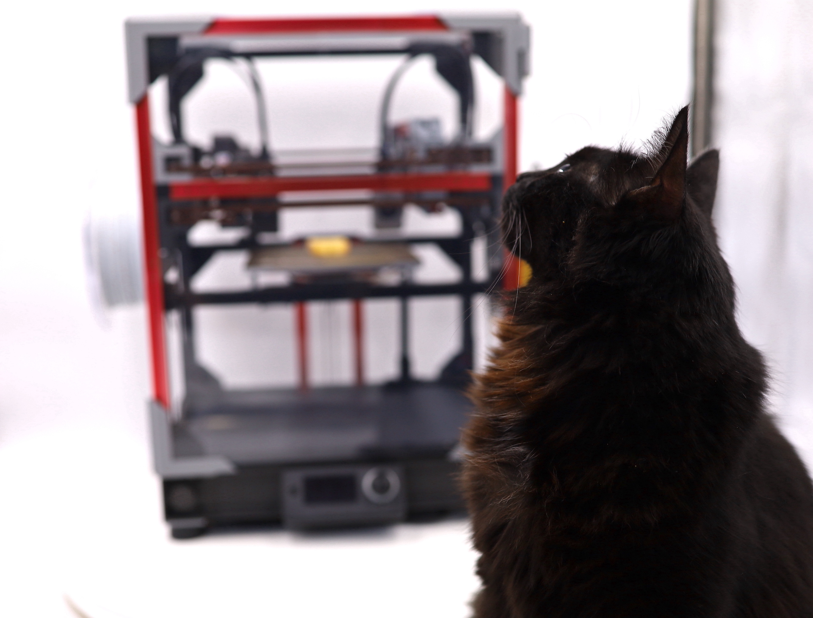
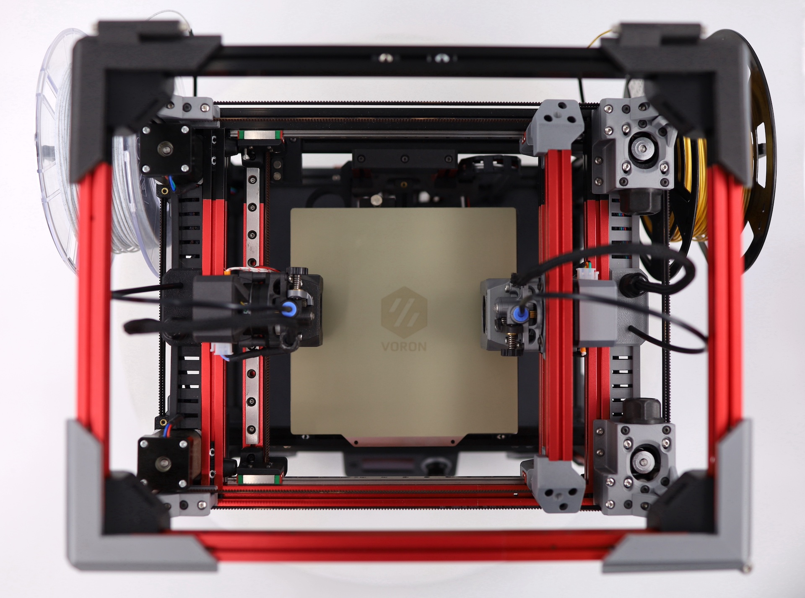
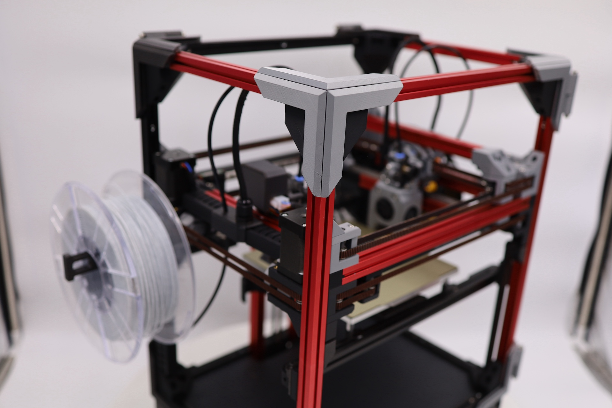
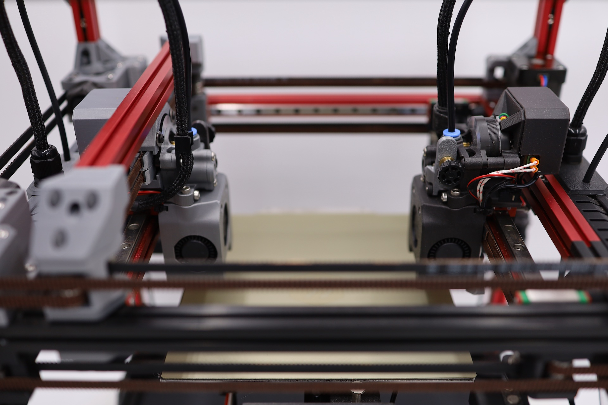
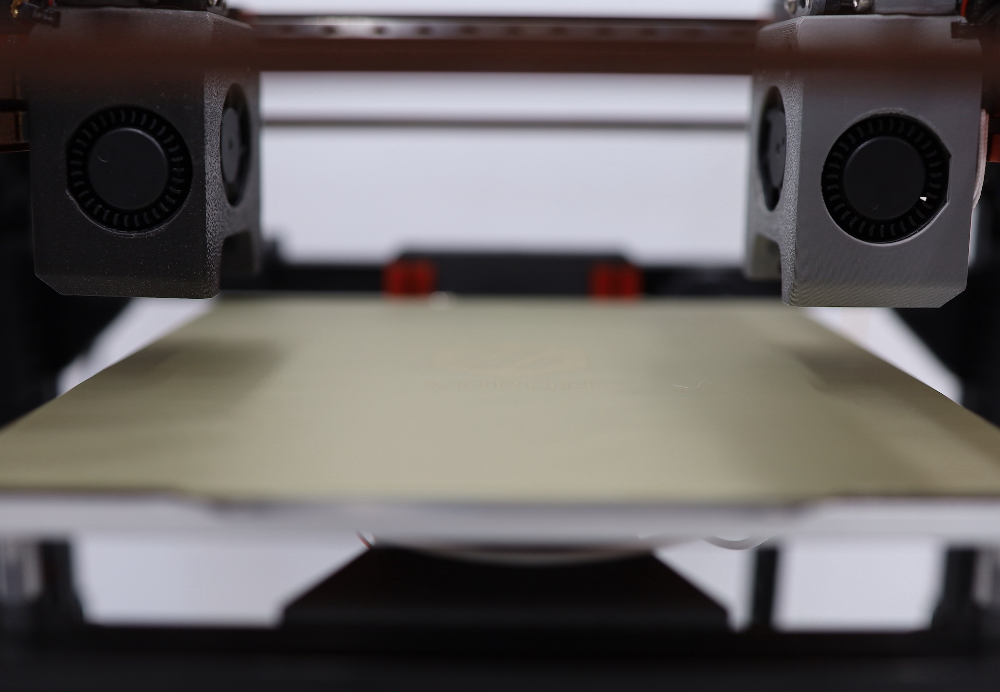
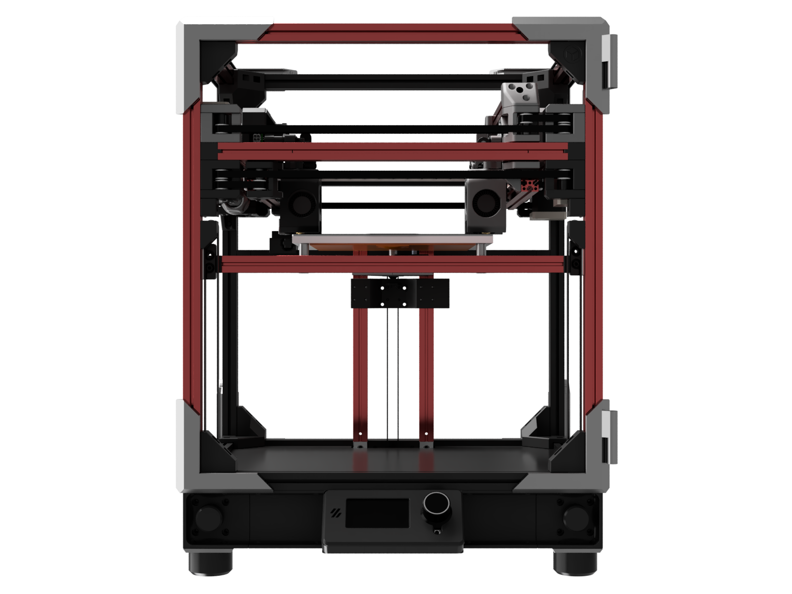
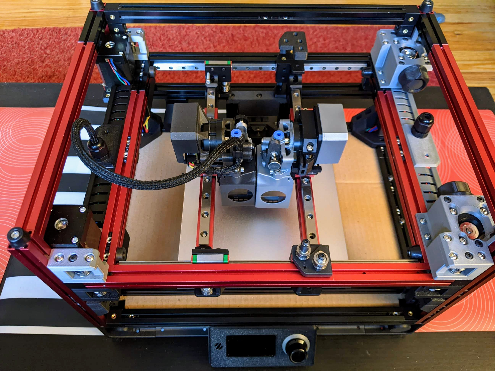

The v1 gantry refers to original release from August 2022, with asymmetric underslung gantries: a low side, plus a high side with a strut.

There's nothing _wrong_ with this gantry, and Zruncho got 300 hrs out of his before upgrading, but it has some drawbacks relative to the v3:
* more unique parts
* less travel available in XY
* no nozzle-based bed probing
* top-mount rails constrain toolhead availability, somewhat
* different weights for each moving gantry means different input shaper values

All the v1 content is left here, to make things easier to find for those with builds in progress, or for those curious about the (more complex) design process with this one.

Reality:

|  |  |  |
| - | - | - |

Renders:

|  |  |  |
| - | - | - |

### Is it real?

Yes.

The first D0 build from Zruncho puts a [Tri-Zero](https://github.com/zruncho3d/tri-zero) Plus50 Z setup below the two twisted-90-degree [BoxZero](https://github.com/zruncho3d/BoxZero) gantries above, using a V0-derived frame.

Highlights of this particular build:

* XY Motion and Toolhead
  * Customized [ZeroClick](https://github.com/zruncho3d/zeroclick) for bed probing
  * 2x [Mini-AfterSherpa](https://github.com/PrintersForAnts/Mini-AfterSherpa) toolheads with [Revo Voron](https://e3d-online.com/products/revo-voron) hotends
  * 2x [Sherpa Mini](https://github.com/Annex-Engineering/Sherpa_Mini-Extruder) extruders
  * [BoxZero](https://github.com/zruncho3d/BoxZero)-derived motor blocks
* Frame and Z Motion
  * Rail-less Z motion (!) using printed MGN7 sliders - **new in this printer**
  * Tool-less, removable-in-seconds sealed enclosure with [Technologic-style ZeroPanels](https://github.com/Tecnologic/ZeroPanels/tree/main/Mods/tecnologic/FlyingZero300/STLs)
  * [Tri-Zero](https://github.com/zruncho3d/tri-zero) triple-belted Z (simple, low-cost, and fast) with tool-less belt attachments
  * LDO Red 1515 V0 frame kit, with added MakerBeamXL 300mm, 200mm, and end-joined 50mm pieces
  * AC 180x180 [Prusa Mini size plate bed](https://www.aliexpress.com/item/3256803530287164.html) with textured and smooth PEI sheets
* Electronics
  * 2x EBB42 toolhead boards
  * BTT U2C USB CAN board
  * LRS-150-24 Power Supply
  * Raspberry Pi Zero 2 W
  * 2x SKR Pico controller boards
  * Mini 12864 display with [Klipper adapter](https://www.aliexpress.com/item/3256802553287831.html)
* Other
  * Travel: ~170mm x 165mm in XY, ~130mm in Z (but... completely unoptimized)
  * Frame: 360 x 280 x 480 in XYZ.  Enclosure, feet, and displays add a bit to this.
  * Filament: mix of KVP ABS flavors: Metallic Silver, Black, and Stellar Black.
  * [PrinterExperiments](https://github.com/zruncho3d/printer-experiments) code for easy Z nozzle alignment with a single command
  * More F623 bearings than you’ve ever seen on one printer.  So many!
