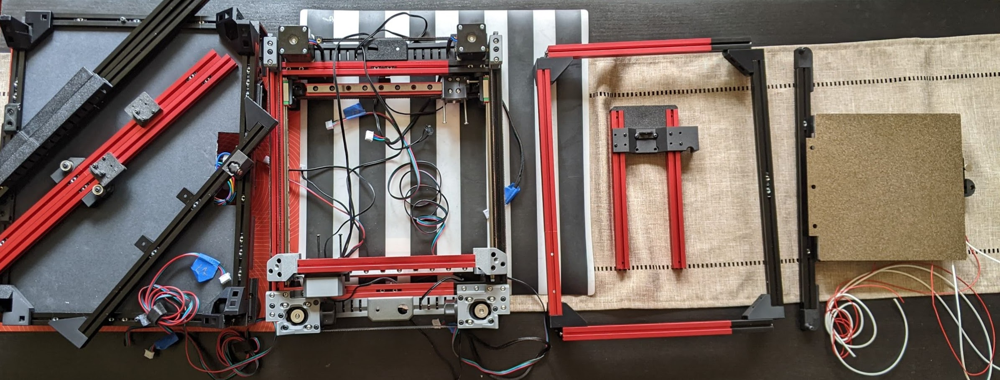

## Printing Instructions

**NOTE**: CAD exists to show what’s possible.  NOT to be an exact copy of anything except the gantry.  That’s true-to-life (to Zruncho's build), but the rest is out-of-date stuff.  If you go to the appropriate repos, you’ll have up-to-date stuff.  ZP, T0, B0.  All those are out of date within the CAD!

Parts in this repo are intentionally only the delta from other projects, so that as those projects evolve, you get the latest parts, and there's no copy/paste maintenance overhead.  Life is too short for such toil.

Really, only the gantry and the T0 idler base parts are special here.
* Standard Voron settings should be fine for all custom parts: 40% infill, 4 perims, 5 top/bottom layers, 0.2mm layer height.  Lower infill is likely fine.

For print settings:
* Use BoxZero settings for BoxZero corners.
* Use Tri-Zero settings for Tri-Zero parts.
* Use ZeroPanels settings for ZeroPanels parts.

As a reminder, BoxZero corners will need a lower layer height (0.16 mm) and/or wider extrusion width (0.55 mm), as they have the highest-angle overhangs.

A distinct color per gantry and per toolhead really does help keep things sane!  It's easy to get turned around when the gantry is upside-down, and when each gantry itself is flipped from the usual V0 orientation.

**NOTE**: quantities (e.g., "_x2") are for the whole printer.  So if you have two distinct-color gantries, do half of the totals for each even-quantity part with each color.  

**NOTE**: Some files are missing here as STLs and CAD currently, which will be needed to match the default size, specifically:
* longer front and side skirt parts
* wider side fans
* baseplate dxf

**NOTE**: All STLs are oriented with the least-visible seam in the back, and with the correct bed-plate orientation.  For most parts - ABs and XYs - you can hide the seam where an extrusion will block its view.

The good news - the gantry parts are all scalable! You can start on the gantry if you want.

## Assembly Instructions

In general, the CAD should be your primary reference.  Don’t expect 100% of all screws, nuts, and heatsets to be present in CAD, though... the model is already big enough, and it leaves out some bits that should be obvious.

### Prep

* Join extrusions as needed with 20mm set screws, using the BoxZero instructions for this:
  * 4x 200 + 200
  * 2x 200 + 100 (front, color-matched)
  * 10x 200 + 50
* Drill new holes for blind joints, using the V0 drill guide.
  * 8 holes in the back 400mm verticals at ends
  * 4 repositioned gantry blind access holes in the 300mm.  Use the 15mm corner cubes for these to get the right position with the drill guide.
* Print out a small army’s worth of no-drop nuts ([NDN](https://github.com/zruncho3d/f-zero/tree/main/STLs/NoDropNuts)s).  Size these to your extrusions.  If using a mix of LDO + MBXL, keep them apart, as the sizes will be different.  You don’t want to have to pause the build for these, or hold off on adding them everywhere because you’re running low.
* Print out extra cable channels and Wago mounts.

#### Build

It’s a cake with layers.  You make the layers independently, then you join them.  Most of the rest of the order is really up to you.

In all steps, make sure to add more NDNs that you think might need!  You’ll need a lot, especially as all corners add 4-6 NDNs.

In all steps, get screws finger tight, but wait until the printer includes all parts to fully tighten all (accessible) screws.

General (order is flexible - do what you enjoy first):
* Match-fit all extrusion tabs on corners to the corresponding extrusions.  Note that extrusions have different slot widths, so be careful here.
* Build the base + skirts layer, along with lower BoxZero corners and MotoroCorners
* Mount all electrical elements and route wires
* If using BoxZero corners, build the top crown with 4 corners and 4 horizontal extrusions.  Having these corners enable a single module, even if you have a full-metal frame, is really handy for easier assembly and disassembly.
* Build and test toolheads and Boops
* Build top crown
* Build the bedframe (for T0)

XY:
* Build the complete double-gantry by itself, as a separate module.
    * Add X rails to X extrusions, ensuring alignment
    * Add Y rails to Y extrusions, ensuring alignment
    * Match-fit tabs in ABs and XYs to extrusions (see BoxZero repo for examples of plastic curl you should see)
    * Build individual AB blocks and install all bearings/spacers, using CAD as a reference.
    * Build XY joints and install all bearings/spacers.  One m2 head will be tight; leave the allen in on that one, so that it's much easier to tighten when in a module.
    * Add endstop triggers and bases to the appropriate extrusions.
    * Connect two ABs into a side module, twice.
    * Connect two XYs into a Y gantry module, twice.
    * Connect AB modules to Y extrusions.
    * Attach Y gantries to the gantry frame and soft-tighten all m2s.
    * Attach toolhead carriages, loosely.  MAKE SURE THE GANTRY IS FLIPPED, relative to the usual Pandora orientation.  The screws will be in the "fall out with gravity" orientation when correct.
    * Route each of the 4 belts through the "Pandora redirection bearings" first, pushing in from the outside, then wrapping around, and pushing with an allen wrench from the inside, and back around.  You will have easy access to these belts when the verticals are not in the way.  Do all 4 of those, then add the rest of the belts and attach them to the carriages loosely.  This is the key step.
    * Add motors and align pulleys.
* Highly recommended: do all gantry electrical and config testing as a regular CoreXY on the left, and then on the right.  You want to ensure nothing is wrong with the whole XY motion stack before spending time to drop in and align the gantry.  It's motivating to have an intermediate milestone, too.  You don't even need toolheads at this point.  
* Attach toolheads and test them too.
* Optionally, configure Dual Gantry CoreXY Klipper kinematics and get T0 and T1 working.

Z:
* Build the rear Z assembly, with rails or sliders, and join it to the rear crossbar.
* Add cable channels to the rear verticals.
* Assemble rear verticals with cable carriers.
* Assemble the front verticals with T0 parts and rails or sliders.
* Add Z belts.  
* Test Z electrically, while everything is easily accessible.  You may need to slightly loosen the long front gantry screws which hold the custom T0 idler bases to make this possible. All 3 Z motors should go in the same direction, once directions are set correctly.

Main Assembly:
* Add all verticals to the base, including the rear Z frame.  Now you have a "bed of nails" layout.
* Slide in the gantry from above, matching each nail in the "bed of nails".
  * Recommended: use the joining point of the verticals as a measurement reference to get the gantry at a level height.  
  * Do an initial tightening.
* Slide on the top crown.
* Tighten all non-gantry screws.  A lot of them.
* Measure and align the gantry, so that it is as parallel as possible to the bed.  Tighten all gantry-to-frame screws (12).  106mm between bottom of top extrusions and top of gantry extrusions worked for Zruncho's build to give sufficient umbilical clearance to the top panel, but 100mm might be possible, and would make alignment super-fast with 4x 100mm extrusions and the frame upside-down temporarily.
* Add the bedframe.
* Do a complete XYZ homing cycle and maybe some z-tilt-adjust action.

Then, bask in the glory of a fully-built, Dual-Gantry CoreXY printer, one of the first of its kind.  Share it on `#dueling-zero-dev` and receive kudos.
