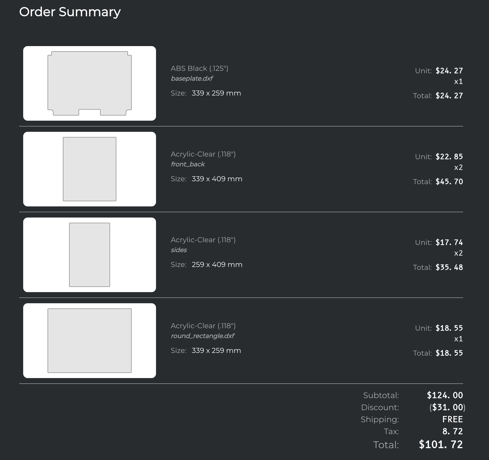
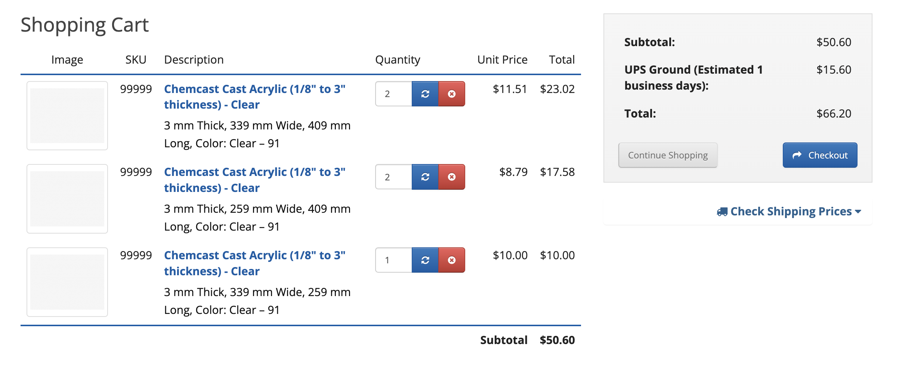
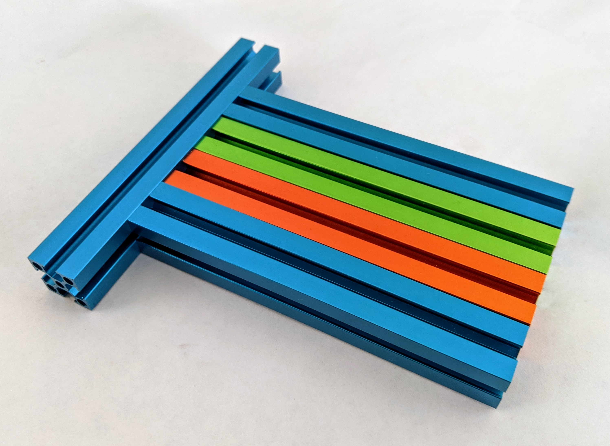

## Parts List

In general, none of the parts here should be a surprise.

Yes, extrusions will get longer, X rails are longer, and you’ll need longer belts.  You’ll want longer Y rails if doing T0+.

In fact, it may be cheaper to just buy two V0 kits and supplement with a few parts.  You'll want:

* 2x [250mm MGN7H rails](https://www.aliexpress.com/item/2251832694486732.html?)
  * Make sure to also buy a ‘Carriage Only’ part and message the seller to add it to the rail before they ship it.
* [2x 200mm MGN9C rails](https://www.aliexpress.com/item/2251832586981749.htm)
* 20mm set screws are recommended to double up extrusions, just like noted on the BoxZero GitHub.

The bottom baseplate has a custom size, but all other panels are simple rectangles.

| Part | Qty | Dimensions |
| - | - | - |
| Baseplate | 1x | 339 mm x 259 mm (with cutouts)
| Front/Back | 2x | 339 mm x 409 mm
| Sides | 2x | 259 mm x 409 mm
| Top | 1x | 339 mm x 259 mm

With a 25% discount, a SendCutSend order came to ~$100 including all panels,
while a Tap Plastics order came to $50 before shipping, but without the baseplate.

Order Samples:

#### Size: {Small, Stock, Larger}

You don’t have to build it at the default CAD size (~170 x ~170 travel), but that feels like a sweet spot.  Here's why:

* You *can* go smaller with the build - say 300mm fronts, 200mm sides, stock V0 bed - but the toolhead overlap will make the need for endzone dances higher, when printing on the full area.
* Subjectively, the stock larger CAD size feels reasonably rigid, even without rigid panels adding any stiffness.
  * The BoxZero corners add a noticeable amount of stiffness, and the multiple attachment points on the gantry shorten the effective span length of the vertical extrusions.
  * A single rigidly-mounted rear panel should do wonders here, too.
* Anything larger than the default size may need added rigidity.  Maybe you could do a 200x200 bed with 1515… but at that point, 2020 extrusions should be a consideration.
  * On the plus side, Tiny-M provides a roadmap to doing such a 2020 conversion, and when combined with a Tri-Zero port like Ankurv’s one… the work might not be too bad.

For the stock size, you can use the extrusions in a V0 kit, supplemented with:

* 10x 50mm extrusion chunks in the Y dir: most are for the sides and gantry crossbars; plus, one for the bedframe and one for the strut
* 5x 300mm extrusions in the rear: 4 for the box plus for the bedframe crossbar
* 6x 200mm extrusions on the base sides as well as rear verticals
* 1x 100mm extrusion for the bedframe

As a bonus, most holes in the V0 kit can be reused, if you put the right parts in the right places, in advance: mostly for verticals, which need blinds joints all around.

This pic doesn’t show the 50mm chunks accurately, but the rest is accurate.  Add flashes of color where you want, and make it your own.

TBD: Add frame pic

You can buy 200s and join them to 100s to save a little money too.

I keep one 100mm extrusion as a souvenir from each V0, but also to test sliders, which need to be matched to the particular extrusion type, and even batch.

Running out of colors from all the V0 builds...

#### Triple-Z vs Single-Z

You can actually do a single-Z-motor build if you want, and then the whole shebang can use 7 drivers and a single board.  This option isn’t shown in CAD, but should work with stock V0 parts, or maybe minor changes.

If you’re not a fan of cantilevers (Zruncho's hand just raised, too...), and you want a more scalable printer (especially to the T0+50mm size), Tri-Zero is a good option, at the small cost of adding 2 extra Z stepper drivers, motors, and a few other motions parts.  It also has a nozzle endstop by default, which enables automatic, or at least measurement-supported, Z offset calibration.  This alone is a reason to use Tri-Zero, given the importance of the first layer in 3D printing.

#### Control Boards

The control board situation is up to you, but make sure to consider the need to split the gantries across two boards with the current Klipper option (see note above in Klipper section).  In theory, any boards should be fine, as long as you get enough steppers.

CAN toolhead boards are highly recommended, as they reduce your wiring, and enable the use of stock 8-driver boards.  But remember, until Klipper supports two gantries on one instance, you’ll need at least two CAN-bus boards. :thumbsdown:
