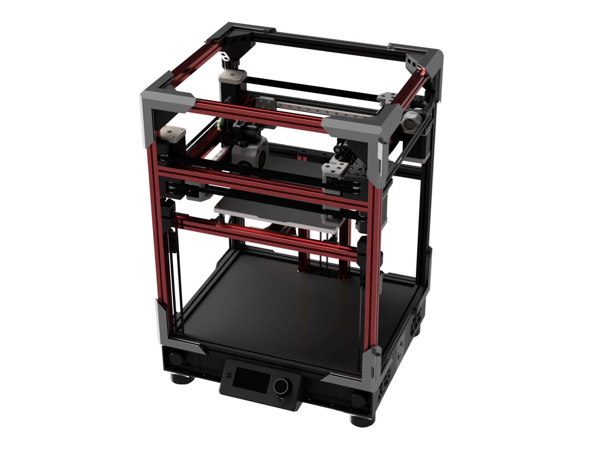
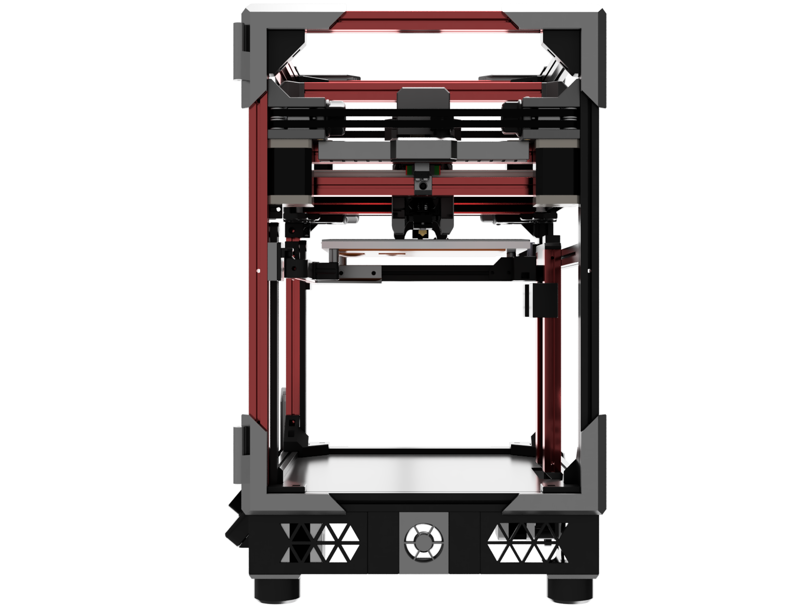
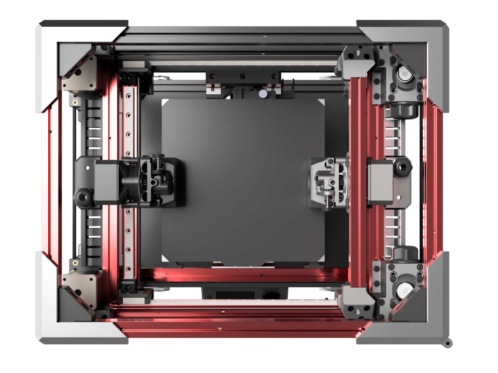
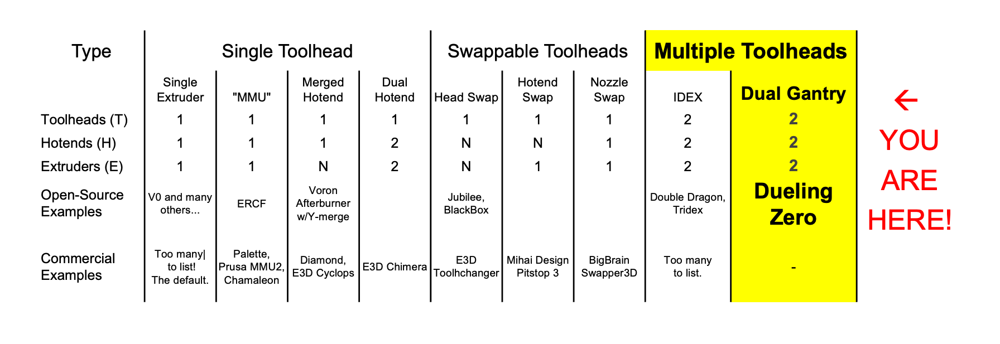
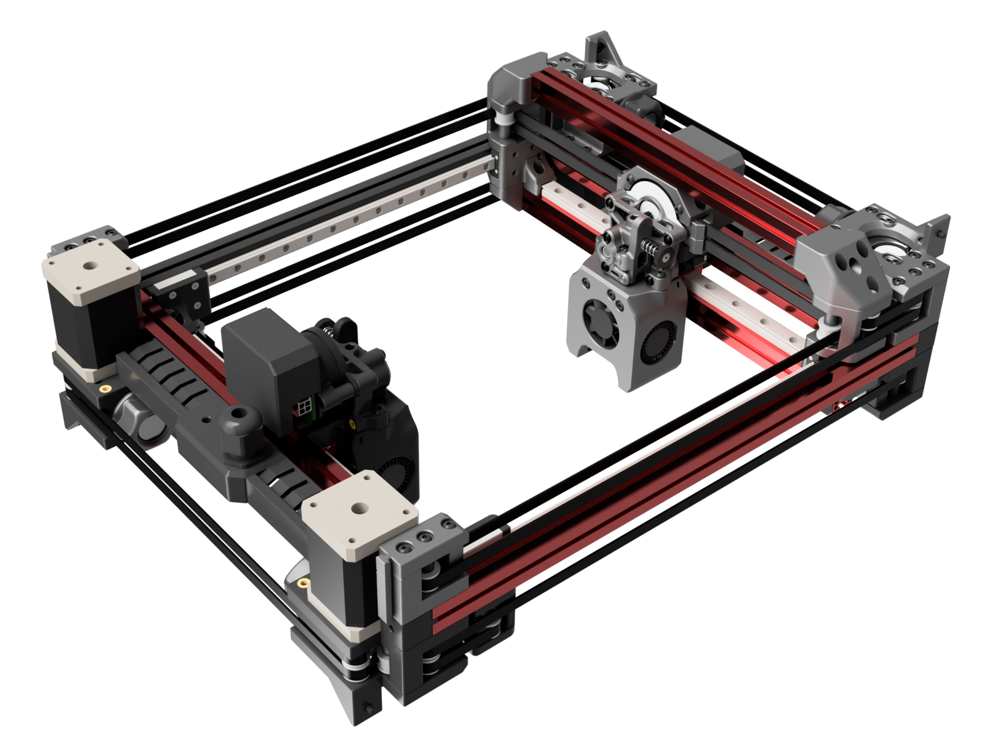

## Dueling Zero - a Dual Gantry V0 mod

**Two extruders.  No compromises.**

Enable dual-color, dual-material, and dual-part printing... with the same speed and quality as single-extruder printing.

Mod a [Voron Zero](https://vorondesign.com/voron0.1) or build one fresh!

**D0** is the only open-source, fully-documented, reproducible-by-anyone Dual Gantry printer out there.  

It's real, and it prints.

# [> > > Watch Video from first prints](https://youtu.be/2YI3_g30EwA)

Reality:

|  |  |  |
| - | - | - |

Renders:

|  |  |  |
| - | - | - |

## Release History

### 2022-08-20: Alpha-1  
This first release covers everything you need to build and run your own Dueling Zero: CAD, STLs, DXFs, sample firmware configs, smart avoidance code, G-code streaming code, instructions, and a parts list... everything but an illustrated manual.  But if you're reading this, you almost certainly don't need a manual, anyway.

To make it easy for anyone to grok this crazy Dual Gantry layout - and learn about its opportunities and challenges, both in hardware and software - this README walks through the software and the design.

Enjoy!  There's a lot of content here, and I hope you enjoy it as much as I did bringing this concept to life.  -Z.

Join the [Reddit thread](https://www.reddit.com/r/VORONDesign/comments/wtjxk1/is_idex_dead_dueling_zero_two_extruders_no/) on `r/VoronDesign` for any comments, questions, or kudos.

## Table of Contents

There's a ton of detailed content in this repo, beyond this README.

- #### [Overview](#overview): Why Dual Gantry?
- #### [Software](SOFTWARE.md): Two toolheads in one workspace, explained
- #### [Parts](PARTS.md): Parts list to build your own
- #### [Instructions](INSTRUCTIONS.md): Instructions to print, assemble, and configure
- #### [Design](DESIGN.md): Get inside the designer's head.  Mostly renders!  An easy read
- #### [FAQ](FAQ.md): Common questions, answered

## Overview

### What’s a Dual Gantry printer?

**Dual Gantry** is a rare 3D printer type with two toolheads moved by **two** *completely independent* XY motion systems:

Yes, you’re seeing double, with black and silver toolheads in a dual-CoreXY motion configuration.

### Why a Dual Gantry printer?

In general, a second hotend adds enormous flexibility - to support two colors, two materials (typically support + main), and two nozzle sizes, in one print, with no color-bleed issues, cross-contamination, or wasteful purging.  Sounds good, right!

Well, that second hotend, if mounted on a single toolhead, can get in the way of print quality, as it drools filament when not in use - and the toolhead is now custom. :frowning:

So along comes IDEX, short for Independent Dual Extrusion, which adds a second, independent toolhead on a shared axis (typically the X axis).  Sounds better, right?

No drool, plus something cooler: one printer can now print two identical parts simultaneously, in mirror or duplicate modes. :muscle:

Open-source IDEX designs include [Voron](https://vorondesign.com/)-derived ones, like [Zruncho](https://github.com/zruncho3d)’s [Double Dragon](https://github.com/zruncho3d/double-dragon), [Eddietheengineer](https://www.youtube.com/eddietheengineer)'s [Tridex](https://github.com/FrankenVoron/Tridex/), and [Ankurv](https://github.com/ankurv2k6)’s [IDEX Switchwire](https://github.com/ankurv2k6/voron_idex_switchwire).  There's also the [Muldex](https://github.com/3dprintingworld/MULDEX), and there's no shortage of commercial examples, too: [Sovol SV04](https://sovol3d.com/products/sv04), [FlashForge Creator Pro](https://www.flashforge.com/product-detail/flashforge-creator-pro-2-3d-printer), [BCN Sigma](https://www.bcn3d.com/bcn3d-sigma-d25/), [Jadelabo J1](https://www.jadelabo.com/), and many more.

But that second toolhead comes at a cost: moving mass, which has effects on print speed (max accel) and quality (typically, ringing artifacts).  :neutral_face:

> Simplify, then add lightness - [famous quote from Colin Chapman at Lotus](http://www.lotuscars.com.tr/about-us/lotus-philosophy/index-31332.html#:~:text=At%20the%20root%20of%20our,was%20another%20of%20Chapman's%20premises.)

Whether building a fast race car or a fast printer, physics can't be ignored.  

You can mitigate the moving mass somewhat, by using a lighter toolhead, typically with a remote Bowden extruder, but Bowden extruders introduce their own tuning challenges.

**With Dual Gantry, you get a no-mass-added gantry for the common case of single-extruder prints.**  Unlike an IDEX, here, each toolhead is *truly independent* and can move in X *and* Y on its own - [potentially to print two completely different objects at once!](https://forum.duet3d.com/topic/27895/beta-testers-for-multiple-motion-system-support)

There’s no hit to max acceleration or potential for ringing caused by dragging around a heavy second toolhead on a longer rail all the time.

Sure, you can't print more than two colors, like a multi-material unit or toolchanger can, but everything in engineering is tradeoffs.  [As Nero says](https://youtube.com/clip/UgkxAxd22dVnUN7P749WHRpp-yFLg3WqvwTv):

> Multimaterial... sucks.  OK?  There’s no way to do it right.  So either you spend money, time, or waste.  No matter what you do, you're gonna be dealing with that.

Dual Gantry is in an interesting point in a larger space.  **Medium money, medium time, minimal waste**.  It fits within a broader space of 3D printer types that support multiple-extrusion, where the number of toolheads, hotends, and extruders varies:

Take a look here, or at [this other helpful categorization](https://gist.github.com/kmcallister/6636d88802ba00432c65d14e9431c0e6).  This diagram is not comprehensive, but gives a sense for the depth of the design space, and especially, the rarity of everything not on the far left side (typical single-extruder printer).  For some interesting points in the design space, there's only one commercial example!  

(Please file an issue on GitHub if you know of any significant omissions.)

### What’s the catch?

If it sounds too good to be true... it probably is.  :shrug:

You don't have to design it (anymore), but you still need to build it, which is roughly twice the work of a typical printer.  Plus, compared to a typical single-extrusion, single-toolhead 3D printer, there are added cost, complexity, and alignment challenges.

**The main reason you probably have never seen a Dual Gantry 3D printer: firmware support.**

Support for two gantries with one control board is a good start:
* RepRapFirmware: supports two active gantries, out-of-the-box.
* Klipper: thanks to a collaboration with [tircown](https://github.com/tircown), there's a PR available now.
* Marlin: no.

... but to get full motion out of a shared-workspace printer, you really want active collision detection and avoidance.

**Code in this repo enables a functioning printer with *full* bed-travel usage, for any firmware.**

See the [Software](SOFTWARE.md) section for a full explanation, with diagrams, pics, and explanations.

### How does this mod work?

Start with a trusted, tested Voron Zero CoreXY gantry.  Turn it 90 degrees.

Duplicate the copied gantry, then flip it, and make the two crossbars share the same rails.

Flip the XY joints upside down.  Voila!   

That’s the core idea.

In practice, though, there are quite a few additional bits to design to make it work.  And like with any V0 mod, the devil is in the packaging details: *every mm matters*.

Each gantry is heavily customized vs a regular V0, to make an underslung low-side gantry (left, in black) as well as an underslung high-side gantry (right, in silver). Beyond these new gantry XY joints, there’s some extra work to relocate the endstops and add a high-side strut; *something* needs to directly resist the forces of the tensioned belt.  Oh, and the belts can't pass through a motor on the high side, so you have to figure that one out, too.

Fortunately, most of the other needed parts can be repurposed or at least derived from other designs.  

**D0 Alpha-1** heavily leverages off-the-shelf parts from the [BoxZero](https://github.com/zruncho3d/BoxZero) and [TriZero](https://github.com/zruncho3d/tri-zero) mods, plus a few custom parts and custom panels.

If you're not familiar with these mods, here's a pic, showing a Plus50-size Tri-Zero + BoxZero printer (170x170 bed motion), next to a V0-size (120x120 bed motion) Tri-Zero + BoxZero.

[TriZero](https://github.com/zruncho3d/tri-zero) adds automatic bed leveling and enables XY scalability.

[BoxZero](https://github.com/zruncho3d/BoxZero) ditches the tophat.

### Is it real?

Yes.

The first D0 build from Zruncho puts a [Tri-Zero](https://github.com/zruncho3d/tri-zero) Plus50 Z setup below the two twisted-90-degree [BoxZero](https://github.com/zruncho3d/BoxZero) gantries above, using a V0-derived frame.

Highlights of this particular build:

* XY Motion and Toolhead
  * Customized [ZeroClick](https://github.com/zruncho3d/zeroclick) for bed probing
  * 2x [Mini-AfterSherpa](https://github.com/PrintersForAnts/Mini-AfterSherpa) toolheads with [Revo Voron](https://e3d-online.com/products/revo-voron) hotends
  * 2x [Sherpa Mini](https://github.com/Annex-Engineering/Sherpa_Mini-Extruder) extruders
  * [BoxZero](https://github.com/zruncho3d/BoxZero)-derived motor blocks
* Frame and Z Motion
  * Rail-less Z motion (!) using printed MGN7 sliders - **new in this printer**
  * Tool-less, removable-in-seconds sealed enclosure with [Technologic-style ZeroPanels](https://github.com/Tecnologic/ZeroPanels/tree/main/Mods/tecnologic/FlyingZero300/STLs)
  * [Tri-Zero](https://github.com/zruncho3d/tri-zero) triple-belted Z (simple, low-cost, and fast) with tool-less belt attachments
  * LDO Red 1515 V0 frame kit, with added MakerBeamXL 300mm, 200mm, and end-joined 50mm pieces
  * AC 180x180 [Prusa Mini size plate bed](https://www.aliexpress.com/item/3256803530287164.html) with textured and smooth PEI sheets
* Electronics
  * 2x EBB42 toolhead boards
  * BTT U2C USB CAN board
  * LRS-150-24 Power Supply
  * Raspberry Pi Zero 2 W
  * 2x SKR Pico controller boards
  * Mini 12864 display with [Klipper adapter](https://www.aliexpress.com/item/3256802553287831.html)
* Other
  * Travel: ~170mm x 165mm in XY, ~130mm in Z (but... completely unoptimized)
  * Frame: 360 x 280 x 480 in XYZ.  Enclosure, feet, and displays add a bit to this.
  * Filament: mix of KVP ABS flavors: Metallic Silver, Black, and Stellar Black.
  * [PrinterExperiments](https://github.com/zruncho3d/printer-experiments) code for easy Z nozzle alignment with a single command
  * More F623 bearings than you’ve ever seen on one printer.  So many!

### Learn more!

If you've read this far, great, but you haven't gotten to the good stuff.

There's 10x the info beyond this README file, in the repo, split into multiple pages.

Take a look around, or up at the Table of Contents above.

## Links

### Dual Gantry

They do exist.  Others have built printers or similar CNC devices with at least two gantries operating in a single shared workspace:

* [Essentium HSE 280i](https://www.essentium.com/3d-printers/high-speed-extrusion-280/): large, high-dollar, linear-servo printer with two gantries
* [Cronus](https://www.youtube.com/watch?v=TkEOMQ6rQ6s): a 5-head, single-workspace 3d printer
* [Dual Gantry CNC Machining Centers](https://www.cronsrud.com/cro-dual-gantry.html): a related CNC
* [Earlier motion platform example](https://www.youtube.com/watch?v=S_7VCEe3hOk): dates to 2012!

There are also a bunch of posts online with people conceptualizing the concept, dating back years.  The benefits/drawbacks are relatively straightforward to understand, though not widely known.  For a few builds, there are mentions online, but no reference to a video or link to learn more.

* 2018-06-04 [Duet Forum post by 3D_low](https://forum.duet3d.com/topic/5561/did-anyone-make-a-idex-with-dual-x-gantry-bar): "Did anyone pull that off yet? i havent found one on the net."
* 2018-11-21 [Duet Forum post by Haggan90]((https://forum.duet3d.com/topic/7796/haq-xy/122)): HaqXY is a dual Hybrid-CoreXY
* 2021-05-01 [Reddit post by u/lowfat](https://www.reddit.com/r/Reprap/comments/n2tkvb/corexy_with_dual_fully_independent_gantries/): postulates DG, but abandoned in favor of a toolchanger
* 2021-07-21 [Duet Forum post by breed](https://forum.duet3d.com/topic/24258/independant-dual-gantry-corexy/10?_=1657058082320): "Independent Dual Gantry CoreXY"
* 2021-09-17 [Duet Forum post by oliof](https://forum.duet3d.com/topic/25158/core-xy-idex-with-two-gantries/15): "Core XY - Idex with two gantries", has a nice diagram
* 2022-01-27 [Klipper Discourse post](https://klipper.discourse.group/t/dual-gantry-printer-with-single-mcu-btt-gtr-btt-m5/1900): Dual gantry printer with single MCU
* 2022-03-25 [Duet Forum post by dc42](https://forum.duet3d.com/topic/27895/beta-testers-for-multiple-motion-system-support/41): Beta testers for multiple motion system support: simultaneous multi-printing for RRF v3.5.  Note two pictures, for motion designs from breed and slaughter2k
* 2022-06-23 [Duet Forum post by zruncho](https://forum.duet3d.com/topic/29023/independent-dual-gantry-any-examples-out-there/10): is anything out there?

Please raise an issue for this repo to update the list of links if you come across one!  There’s no pretense of true originality here.

### Related

* [Bill Deckingham’s beast](https://www.youtube.com/watch?t=488&v=O_whcaAJpfs&feature=youtu.be): a CoreXYUVAB system, with extra axes for a very different reason.  Maybe some software lessons or relevant RRF config here?
* [Hashprinter](https://forum.duet3d.com/topic/24287/hash-printer-with-super-simple-gantry/2): super simple gantry
* TAMV = Tool Alignment with Machine Vision: a way to automate XY calibration
  * [Jubilee Toolchanger page](https://jubilee3d.com/index.php?title=TAMV)
  * [HaythamB fork](https://github.com/HaythamB/TAMV)
  * [TAMV on Klipper](https://github.com/TypQxQ/TAMV)
* [Klipper PR by Tircown that adds duplication and mirror modes](https://github.com/Klipper3d/klipper/pull/4464)
* [PitStop3](https://mihaidesigns.com/pages/pitstop-3-multi-material-3d-printer): hotend-swapping multi-material printer
* [Swapper3D](https://www.kickstarter.com/projects/bigbrain3d/swapper3d): nozzle-swapping multi-material printer
* [Enraged Rabbit Project](https://github.com/EtteGit/EnragedRabbitProject): add multimaterial capability
* [3D Chamaleon](https://www.3dchameleon.com/): automatic color changer

## Credits

* **Tircown**: made a single-Klipper-instance version possible, with his code and live debugging
* **Reviewers: Red5, _xbst, where’sthelambSAUCE, BeastBc**: thanks for providing feedback that helped make this clear and concise.
* **Clee, Red5, Kyrios, Leopard, EddieTheEngineer, and others**: initial conversations proved motivating - that this wasn’t completely insane.  Thanks!
* **Nemgrea**: none of this would have happened without a solid base.

## Support

There's a [Reddit thread](https://www.reddit.com/r/VORONDesign/comments/wtjxk1/is_idex_dead_dueling_zero_two_extruders_no/) on `r/VoronDesign` for any comments or questions.
